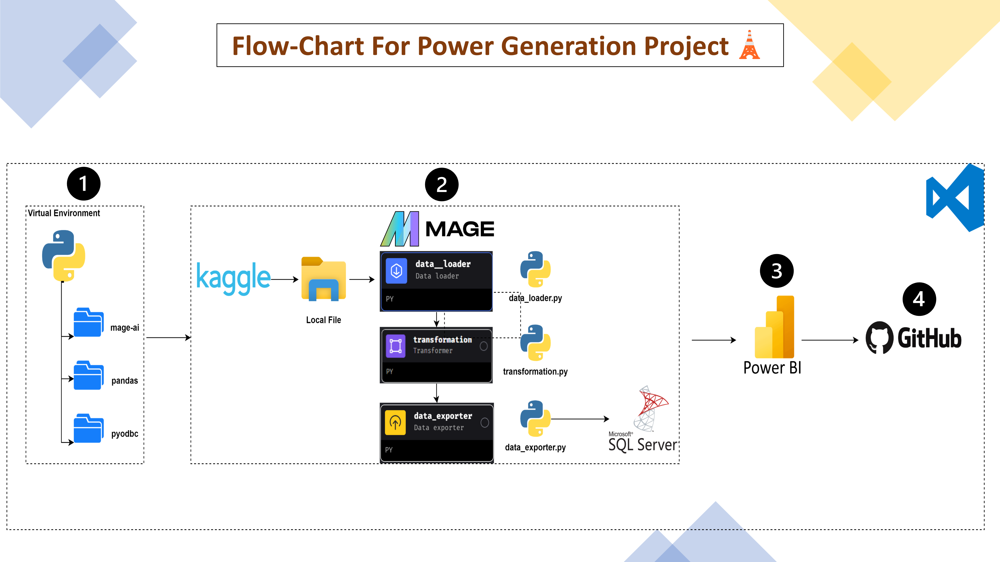
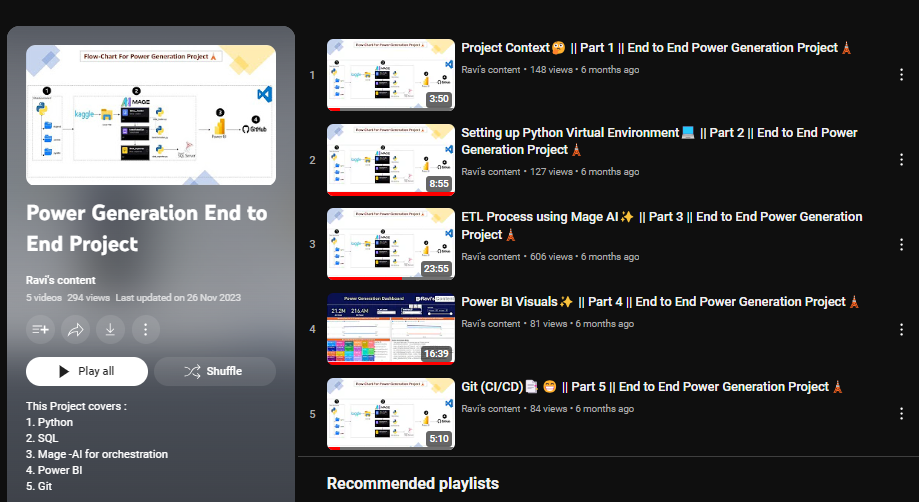

# Mage AI 🧙: End to End Power💪 Generation Project🛣️

This project will cover an end to end example of how to use Mage-AI for ETL/ELT process.

## Problem Statement
**Power Generation Analysis and Optimization Project**

The project aims to analyze and optimize power generation data using modern data engineering and analytics tools. By leveraging data from Kaggle and performing ETL (Extract, Transform, Load) operations using Mage, the project will export transformed data to SQL Server for further analysis and visualization in Power BI. The ultimate goal is to provide actionable insights to enhance power generation efficiency and decision-making processes.

## Architecture Diagram

## Key Objectives
- **Data Acquisition**: Collect and manage power generation data from Kaggle.
- **Data Processing**: Implement ETL processes to clean, transform, and export data for analysis.
- **Data Storage**: Store the processed data in SQL Server for secure and efficient querying.
- **Data Analysis and Visualization**: Utilize Power BI to create insightful visualizations that aid in understanding power generation patterns and identifying optimization opportunities.
- **Collaboration and Version Control**: Use GitHub for project collaboration, version control, and code management.

## Tech stack Used:
1. Python
2. SQL
3. Mage -AI for orchestration
4. Power BI
5. Git

## Video Tutorial

- Full Playlist : 👉[Link](https://www.youtube.com/playlist?list=PLgLr3tsg81jLDFgi-oK_X7alchTkiFjLR)

## Benefits and Outcomes
- **Enhanced Data Quality**: Improved data cleaning and transformation processes ensure high-quality data for analysis.
- **Actionable Insights**: Power BI dashboards provide valuable insights into power generation patterns and inefficiencies.
- **Efficient Data Management**: Centralized storage in SQL Server allows for efficient data management and querying.
- **Collaboration**: GitHub enables seamless collaboration among team members and maintains a history of changes.

